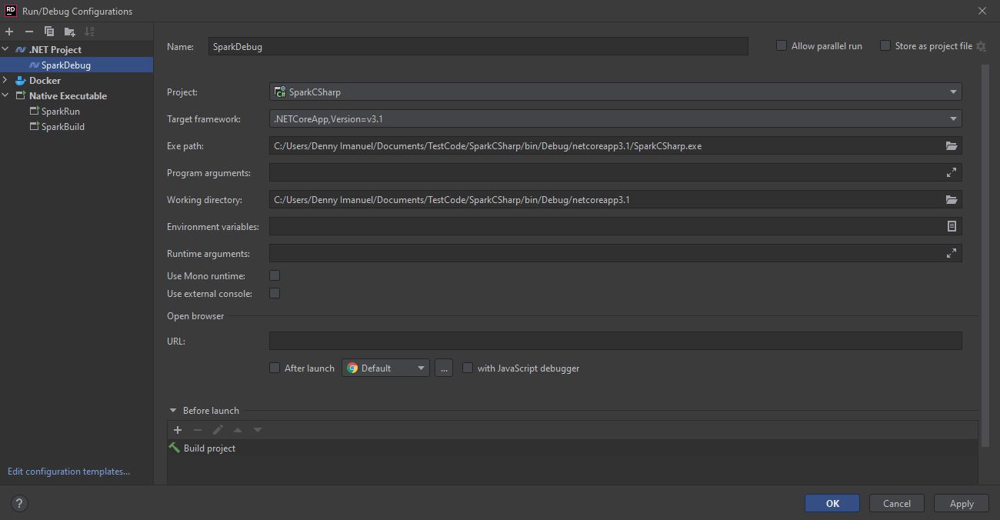

# Spark CSharp
by Denny Imanuel

This mini project showcase how to build and debug Spark.Net application using CSharp programming language. 
There are also options to run Spark application on Spark container 

## Spark on Localhost

### Requirement

1. Rider IDE / Visual Studio - You need to install Rider IDE or Visual Studio
2. Java JDK - You need to install Java JDK and set JAVA_HOME env
3. [Spark Hadoop](https://archive.apache.org/dist/spark/spark-3.1.2/spark-3.1.2-bin-hadoop3.2.tgz) - You need to install Spark Hadoop and set HADOOP_HOME and SPARK_HOME env
4. [Spark Worker](https://github.com/dotnet/spark/releases/download/v2.0.0/Microsoft.Spark.Worker.netcoreapp3.1.win-x64-2.0.0.zip) - You need to install Spark Worker and set DOTNET_WORKER_DIR env
5. [WinUtils](https://github.com/steveloughran/winutils/raw/master/hadoop-2.7.1/bin/winutils.exe?WT.mc_id=dotnet-35129-website) - You need to copy it to Spark Hadoop installation directory
   
For more info: https://dotnet.microsoft.com/en-us/learn/data/spark-tutorial/install-spark

### Build Config

To build Spark app run Spark Submit command or create a new configuration under External Executable as follows:

    dotnet build
    spark-submit --class org.apache.spark.deploy.dotnet.DotnetRunner --master local bin\Debug\netcoreapp3.1\microsoft-spark-3-1_2.12-2.0.0.jar dotnet bin\Debug\netcoreapp3.1\SparkCSharp.dll

### Debug Config

To debug Spark app run Spark Submit command or create a new configuration under External Executable as follows:

    set DOTNET_WORKER_DEBUG=1
    spark-submit --class org.apache.spark.deploy.dotnet.DotnetRunner --master local bin\Debug\netcoreapp3.1\microsoft-spark-3-1_2.12-2.0.0.jar debug

### Run Config

To run Spark ap run standard .NET Project configuration file. In order to debug run above 'Debug Config' first, set breakpoint, and then run this 'Run Config':

## Spark on Docker

### Requirement

1. Rider IDE / Visual Studio - You need to install Rider IDE or Visual Studio
2. Docker Desktop - You need to install Docker Desktop to run Docker
3. Spark Image - Make sure you pull same version of Spark image as your local Spark:
>docker pull 3rdman/dotnet-spark:2.0.0-3.1.2

### Docker Config

To build and run Spark on Docker you create Dockerfile config or run Docker build command:

>docker build -t sparkcsharp:1.0 .

### Output Result

If the Spark application is successfully build it should print out result table as follows:

    
    

