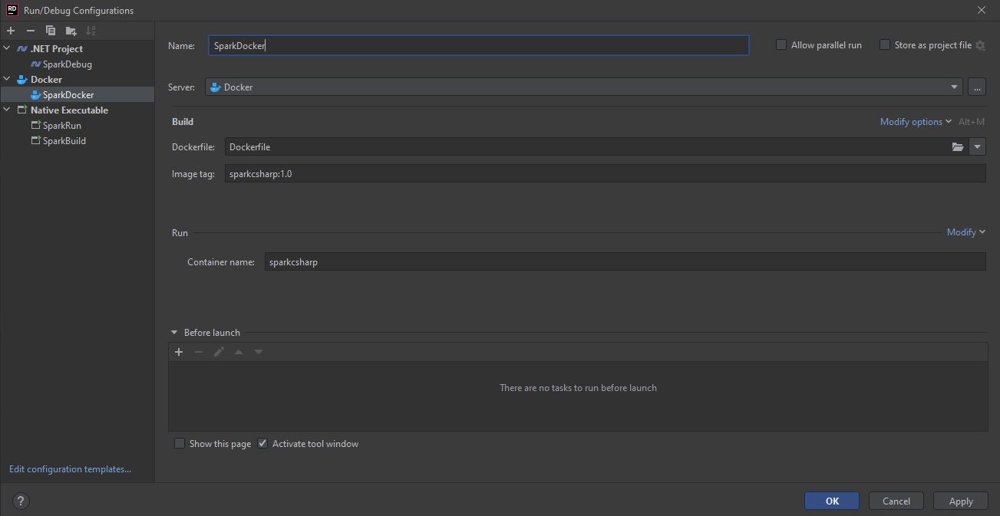

# Spark CSharp
by Denny Imanuel

This mini project showcase how to build and debug Spark.Net application using CSharp programming language. No physical Spark server required for development because we can use Spark container on Docker. 

## Spark on Docker

You can run and debug Spark app using Spark container without necessary to install any Java/Spark on your local machine.

### Requirement

1. Rider IDE / Visual Studio - You need to install Rider IDE or Visual Studio
2. Docker Desktop - You need to install Docker Desktop for Windows

### Compose Configuration

Modify docker-compose.yml to mount your absolute path for bin\Debug to container path /dotnet/Debug and then run this on terminal:

    docker-compose up

Or alternatively on Rider IDE choose 'Docker>Docker-Compose' configuration and set as follows:

### Run/Debug Configuration

## Spark on Localhost

You can also choose to run Spark on your local machine by installing Java/Spark first:

### Requirement

1. Rider IDE / Visual Studio - You need to install Rider IDE or Visual Studio
2. Java JDK - You need to install Java JDK and set JAVA_HOME env
3. Spark Hadoop - You need to install Spark Hadoop and set HADOOP_HOME and SPARK_HOME env
4. Spark Worker - You need to install Spark Worker and set DOTNET_WORKER_DIR env

### Run Configuration

On Rider IDE 'Run Configuration' use '.Net Executable' config and in 'Program Arguments' field enter:

    spark-submit --class org.apache.spark.deploy.dotnet.DotnetRunner --master local bin\Debug\netcoreapp3.1\microsoft-spark-3-0_2.12-1.0.0.jar dotnet bin\Debug\netcoreapp3.1\mySparkApp.dll

### Build Configuration

On Rider IDE 'Debug Configuration' for '.Net Executable' config and in 'Program Arguments' field enter:

    spark-submit --class org.apache.spark.deploy.dotnet.DotnetRunner --master local bin\Debug\netcoreapp3.1\microsoft-spark-3-0_2.12-1.0.0.jar debug

